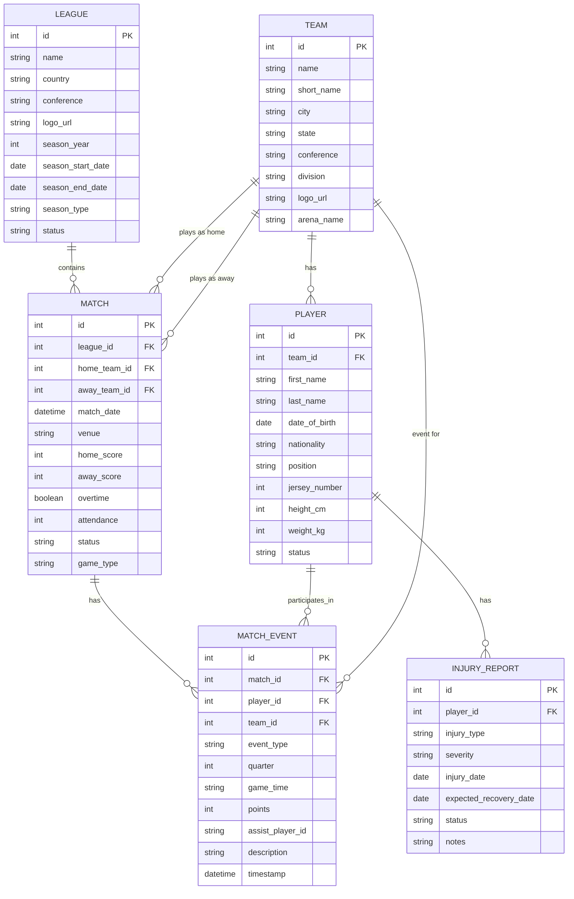

# League Results Dashboard ERD (Basketball)

```mermaid
erDiagram
    LEAGUE ||--o{ MATCH : contains
    TEAM ||--o{ MATCH : "plays as home"
    TEAM ||--o{ MATCH : "plays as away"
    TEAM ||--o{ PLAYER : has
    MATCH ||--o{ MATCH_EVENT : has
    PLAYER ||--o{ MATCH_EVENT : participates_in
    TEAM ||--o{ MATCH_EVENT : "event for"
    PLAYER ||--o{ INJURY_REPORT : has
    
    LEAGUE {
        int id PK
        string name
        string country
        string conference
        string logo_url
        int season_year
        date season_start_date
        date season_end_date
        string season_type
        string status
    }
    
    TEAM {
        int id PK
        string name
        string short_name
        string city
        string state
        string conference
        string division
        string logo_url
        string arena_name
    }
    
    MATCH {
        int id PK
        int league_id FK
        int home_team_id FK
        int away_team_id FK
        datetime match_date
        string venue
        int home_score
        int away_score
        boolean overtime
        int attendance
        string status
        string game_type
    }
    
    MATCH_EVENT {
        int id PK
        int match_id FK
        int player_id FK
        int team_id FK
        string event_type
        int quarter
        string game_time
        int points
        string assist_player_id
        string description
        datetime timestamp
    }
    
    PLAYER {
        int id PK
        int team_id FK
        string first_name
        string last_name
        date date_of_birth
        string nationality
        string position
        int jersey_number
        int height_cm
        int weight_kg
        string status
    }
    
    INJURY_REPORT {
        int id PK
        int player_id FK
        string injury_type
        string severity
        date injury_date
        date expected_recovery_date
        string status
        string notes
    }
```
